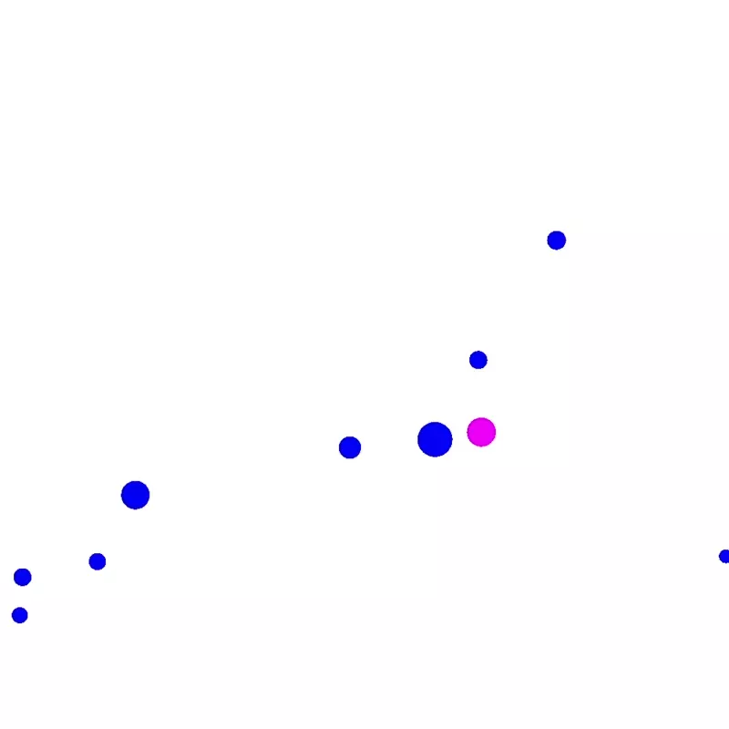

# gym-ball
A ball env build with gym

## Rules

- Blue balls are enemies, red ball is the agent.
- Blue Balls can move in one direction only, red ball is under the control of agent, with a angle in range 0~359.
- Balls have score, and balls can eat each other, eg, A's score is higher than B, and B's ball center is in A's ball, A eats B.
- The speed of moving is influenced by ball's score.
- The aim is to maximum the red ball's score, and game is over if red ball be eaten.

## Usage

- Download the code.
- Change the dir name to gym-ball.
- Install by `pip install -e gym-ball`.
- Run `test.py` for testing.
